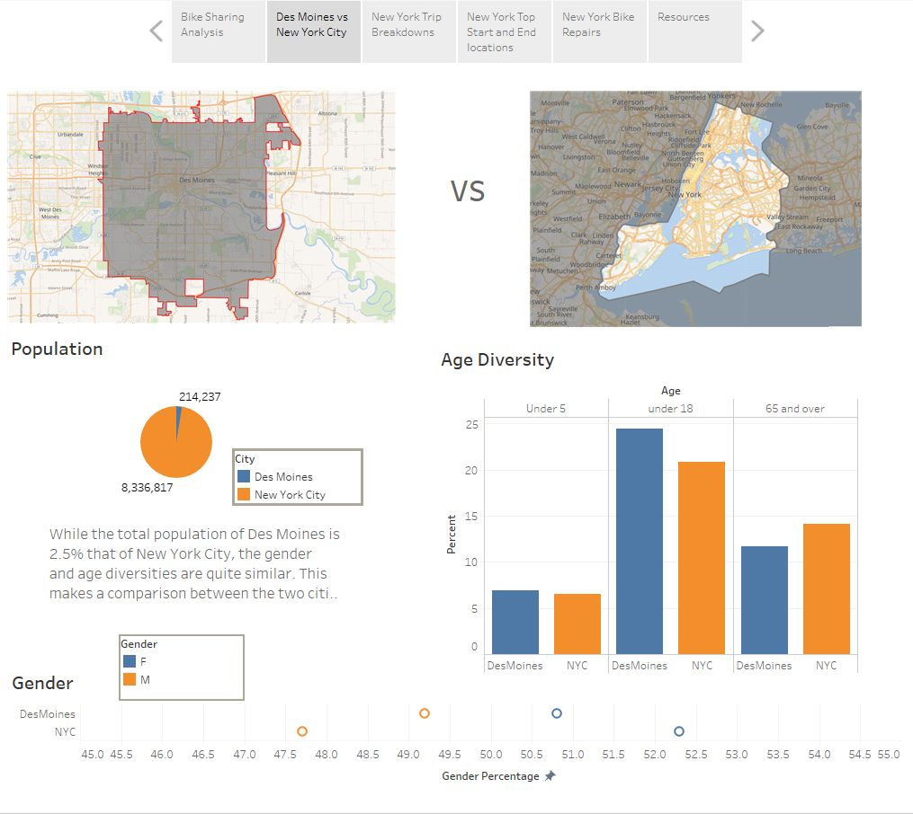

# Bike Sharing Analysis
This analysis is for potential investors in a bike-sharing program in the city of Des Moines, Iowa. Using data from August of 2019 of New York City bike-sharing data, a Tableau story with many types of charts is presented. Is Des Moines a good place for a bike share program?

You can view the story on Tableau Public Link:
https://public.tableau.com/profile/pam.hamrick#!/vizhome/BikeSharingAnalysis_15993519098500/BikeSharingAnalysis?publish=yes

## Comparing New York City to Des Moines
It may appear to be the most unikely comparsion but the chart created show the similarities between the cities.
Comparing the population of both cities shows New York has a much larger population but the similarities in age diversity 
and gender diversity are shown. Knowing these basic similarities, Des Moines would be a great place for a bike share program.

## New York City Bikes
- With the exception of one anomaly at 1969 (about 50 years of age), trip duration age is fairly steady until year 1996 (about 24 years) when it rises through age 18 with the peak duration at 2000 ( 20 years old).
- In New York City, the peak hours of bike usage during August were at 8:00 a.m. and 9:00 a.m. which indicate commuter usage and also between the hours of 4:00 p.m. 
and 7:00 p.m. which could be a mix of commuters and casual usage.
- New York City's CitiBike has nearly 14,000 bikes.

# Further Review
It would be informative to gather information on tourism numbers in Des Moines and to identify which zip codes to focus a study on where to place bike stations.

## Resources
Tableau Public Link:
https://public.tableau.com/profile/pam.hamrick#!/vizhome/BikeSharingAnalysis_15993519098500/BikeSharingAnalysis?publish=yes

Citibike Data:
https://www.citibikenyc.com/system-data

U.S. Census Data:
https://www.census.gov/quickfacts/desmoinescityiowa
https://www.census.gov/quickfacts/newyorkcity

Public Domain Images:
https://digitalcollections.nypl.org/

https://www.mapbox.com

Tableau Desktop - free trial

Tableau Public

